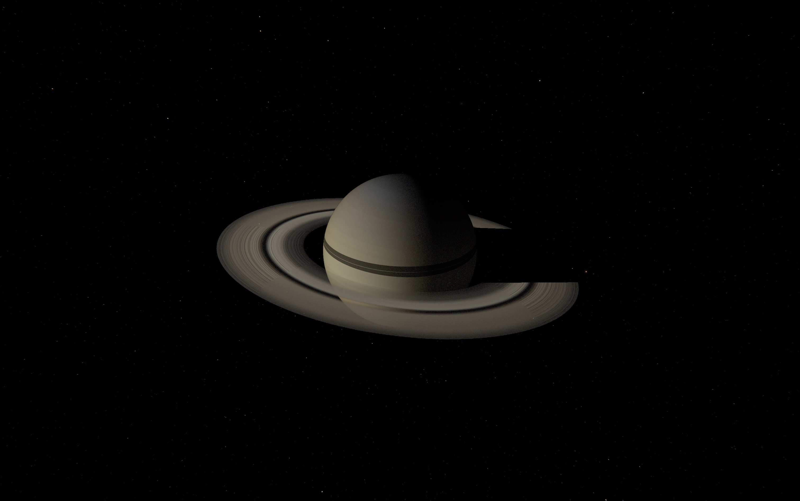

# Thalos



Thalos (working title) is a spaceflight simulation game.

I'm aiming for a more physically grounded take on the genre, with a realistic scaling, simulation that aims for physical plausibility while still being fun to play, and a solar system whose nature reveals itself through exploration.

## Quick Start

Prebuilt Windows and macOS builds are available from the [GitHub Releases page](https://github.com/korbindeman/thalos/releases).

Run the game:

```bash
cargo run -p thalos_game
```

Run the ship editor:

```bash
cargo run -p thalos_shipyard --bin ship_editor
```

Run the planet editor:

```bash
cargo run -p thalos_planet_editor
```


The repository also includes a `justfile` with shortcuts for common commands.

## Playing

You start in a low orbit around Thalos, the homeworld, flying a prebuilt spacecraft.

Controls:

- `W` / `S` pitch
- `A` / `D` yaw
- `Q` / `E` roll
- `Shift` / `Ctrl` raise or lower throttle
- `Z` full throttle
- `X` cut throttle
- `T` toggle SAS
- `Space` pause or resume time
- `.` / `,` increase or decrease time warp
- `\` reset time warp to 1x
- `M` toggle map view
- `V` cycle ship camera mode
- Left drag rotates the camera
- Scroll zooms the camera
- Double-click a body or ship marker to focus it
- `N` place a maneuver node
- `Delete` / `Backspace` delete the selected maneuver node
- `P` toggle photo mode

`Cmd` + left-click (Mac) or `Ctrl` + left-click (Windows) a body in the map-view navigator to move the ship into a low orbit around that body.

## Project Status

This project is in a very early stage. You're welcome to look through the code, but the internals are changing quickly and there is no public-facing documentation yet.

## Acknowledgements

Kerbal Space Program was a major influence on me and the main inspiration for this project.
