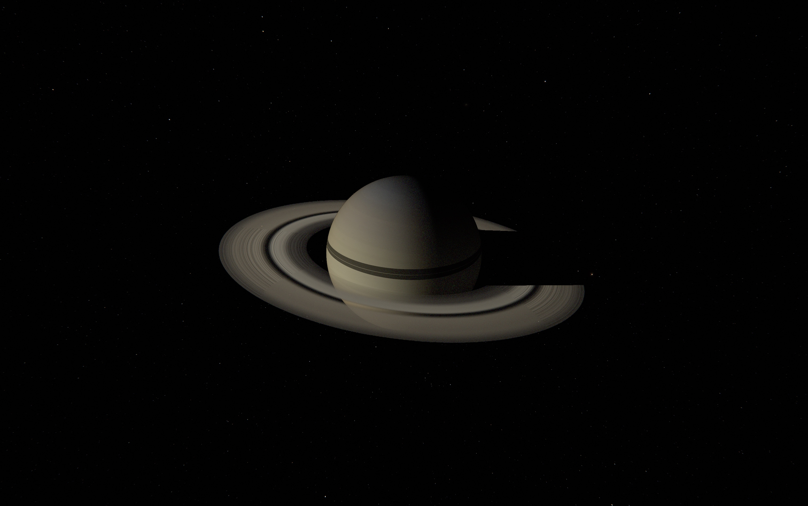

# Thalos



Thalos (working title) is a spaceflight simulation game.

I'm aiming for a more physically grounded take on the genre, with a realistic scaling, simulation that aims for physical plausibility while still being fun to play, and a solar system whose nature reveals itself through exploration.

## Set Up a Development Checkout

### Prerequisites

Install these before cloning:

- [Git](https://git-scm.com/) and [Git LFS](https://git-lfs.com/).
- [Rustup](https://rustup.rs/). The repository's `rust-toolchain.toml` selects
  Rust 1.97.0 and installs `rustfmt` and `clippy`; do not install a separate
  project toolchain by hand.
- [`just`](https://github.com/casey/just), the supported command runner. If your
  package manager does not provide it, run `cargo install just --locked` after
  installing Rustup.
- A current GPU driver. Windows uses DirectX 12 or Vulkan, macOS uses Metal,
  and Linux/WSL headless capture requires a working Vulkan ICD.

Platform build prerequisites:

- **Windows:** Visual Studio 2022 Build Tools with the **Desktop development
  with C++** workload and a Windows SDK.
- **macOS:** Xcode 15 or newer, or the matching command-line tools
  (`xcode-select --install`).
- **Debian/Ubuntu/WSL:** install the native build libraries before running the
  repository setup script:

  ```bash
  sudo apt update
  sudo apt install build-essential pkg-config libasound2-dev libudev-dev \
    libx11-dev libxkbcommon-dev libwayland-dev git-lfs
  ```

Other Linux distributions need the equivalent audio, udev, X11, Wayland,
compiler, and Vulkan development packages.

### 1. Clone the repository and materialize its assets

Install the LFS filters before cloning so large runtime assets are checked out
automatically:

```bash
git lfs install
git clone https://github.com/korbindeman/thalos.git
cd thalos
just terrain-assets
```

`just terrain-assets` is safe to rerun. It downloads and verifies the
runtime-ready learned terrain files if clone-time LFS smudging was unavailable
or deliberately skipped. The current Thalos detail window is about 144 MiB.
Training datasets, model checkpoints, Python, and the separate
terrain-diffusion repository are **not** required to build or render the game;
they are only needed to regenerate that published payload.

If an `.f32` asset contains a few lines beginning with
`version https://git-lfs.github.com/spec/v1` instead of binary data, LFS did not
materialize it. Install Git LFS and rerun `just terrain-assets`.

### 2. Provision the local build environment

The setup scripts write a machine-local, gitignored `.cargo/config.toml` with a
fast linker and a sensible Cargo job budget.

Windows PowerShell:

```powershell
.\scripts\setup-build-env.ps1
```

Linux, WSL2, or macOS:

```bash
bash scripts/setup-build-env.sh
bash scripts/check-build-env.sh
```

On WSL, clone into the Linux filesystem, such as `~/thalos`, not `/mnt/c/...`.
If the Windows script reports that it changed user environment variables, open
a new terminal before building. Parallel-agent and worktree provisioning is
covered in [the build workflow](docs/development/build_speed.md).

### 3. Enable the learned Thalos terrain

The learned terrain payload is versioned with the repository, but the content
backend remains an explicit development choice. Create a gitignored
`.env.just` in the repository root containing:

```dotenv
THALOS_TERRAIN=diffusion
```

Every `just` command loads this file. Without the setting, Thalos uses the
procedural terrain backing; without the large detail payload, the diffusion
backing still runs but falls back to lower-detail terrain around the spaceport.
The extracted tile renderer itself is already the default ground renderer and
needs no additional toggle.

### 4. Verify the checkout

First type-check the game, then render a deterministic off-screen image through
the real GPU path:

```bash
just check
just screenshot spaceport-aerial
```

The screenshot is written to
`artifacts/visual/latest/spaceport-aerial.png`. The first renderer build on a
fresh checkout can take several minutes and use several gigabytes of disk;
subsequent incremental builds are much faster.

Start the game only after those checks pass:

```bash
just game
```

`just game` opens the start screen. Useful direct modes include
`just game runway`, `just game orbit`, and `just game shipyard`. The shipyard is
an in-game editor; there is no supported standalone ship or planet editor.

### Everyday development loop

```bash
just check                              # fast type-check
just test                               # canonical physics tests
just screenshot spaceport-aerial       # headless visual verification
just build                              # full workspace build
```

Use one Cargo command at a time in a worktree. If a dynamic-link build reports
undefined `anon.*.llvm.*` symbols, use the supported `just build-reset` recovery
instead of partially cleaning Cargo artifacts. The documentation map is
[docs/README.md](docs/README.md), and the complete build/capture workflow lives
in [docs/development/build_speed.md](docs/development/build_speed.md).

## Playing

You start in a low orbit around Thalos, the homeworld, flying a prebuilt spacecraft.

Controls:

- `W` / `S` pitch
- `A` / `D` yaw
- `Q` / `E` roll
- `Shift` / `Ctrl` raise or lower throttle
- `Z` full throttle
- `X` cut throttle
- `T` toggle SAS
- `Space` stage (ignite the next stage's engines, jettison spent stages)
- `.` increase time warp
- `,` decrease time warp (steps down into pause below 1x)
- `\` reset time warp to 1x
- `Esc` pause menu
- `M` toggle map view
- `V` cycle ship camera mode
- `F2` save a screenshot to `~/Desktop/thalos`
- `F8` open the saved-viewpoint manager
- `F9` quick-save the current 3-D perspective for agent replay (`just screenshot latest`)
- `F1` or `P` toggle photo mode / clean-frame UI
- Left drag rotates the camera
- Scroll zooms the camera
- Double-click a body or ship marker to focus it
- `N` place a maneuver node
- `Delete` / `Backspace` delete the selected maneuver node

`Cmd` + left-click (Mac) or `Ctrl` + left-click (Windows) a body in the map-view navigator to move the ship into a low orbit around that body.

Debug surface drop: click a body's `drop` button in the map-view navigator, aim the terrain cursor, then left-click the surface to mount the ship there.

## Project Status

This project is in a very early stage and its internals change quickly. Start
with [docs/README.md](docs/README.md) for the maintained architecture, gameplay,
rendering, roadmap, and development documentation.

## License

Thalos is fully source-available, with a deliberate split — **you can't sell the game; you can sell content for it.**

- **Code** — [PolyForm Noncommercial 1.0.0](LICENSE): use, modify, fork, and redistribute for any noncommercial purpose. Selling the game is reserved to the copyright holder.
- **Assets** (art, audio, and authored content under `assets/` and `ships/`) — [CC BY 4.0](LICENSE-ASSETS): share and adapt for any purpose, **including commercially** (e.g. paid planet/part packs), with attribution.
- **Vendored crates** under `crates/` keep their upstream licenses (`udlod` and `volumetric_clouds` are MIT/Apache-2.0 — the stack is permissive end-to-end, no copyleft).
- The **"Thalos" name and logo** are not licensed.

See [LICENSING.md](LICENSING.md) for the full rationale and contribution terms.

## Acknowledgements

Kerbal Space Program was a major influence on me and the main inspiration for this project.
