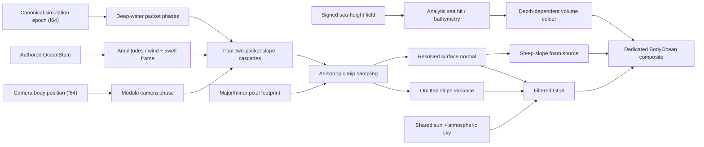

# Ocean rendering

Thalos' ocean is one planetary surface with a deliberately layered detail
model. The planet-scale surface and coastline remain analytic and stable;
near-field wave shape, foam, wakes, and reflections increase independently
without creating a second water authority.

The visual target is a low, open-water view with dark blue-green volume,
directional nested waves, a broken sun road, sparse coherent whitecaps, and a
horizon that belongs to the same atmosphere as the sky. BL-12 established those
signals in the shipping analytic projection; OCEAN-1 adds the first authored,
dispersion-aware spectral tracer behind the same filtered-slope seam. The
production FFT/local-simulation program is still staged rather than implied by
these image-space fields.

## 1. Invariants

1. **One surface:** ADR-20260720T185954Z-analytic-planet-water-never-meshed's
   analytic ray/sphere intersection owns the
   planet-scale water surface at every altitude. A future projected grid is a
   bounded camera-relative displacement layer, never a replacement sea shell.
2. **One coastline:** ADR-20260720T185958Z-water-projects-one-signed-sea-field's
   signed sea-height field alone decides water
   coverage and bathymetry. Simulation fields may respond to depth but cannot
   move the land/water boundary independently.
3. **World-anchored phase:** wave phase is body-fixed. Camera motion, floating
   origin rebases, LOD changes, and render-path swaps must not restart or drag
   the sea.
4. **Energy crosses LODs:** unresolved slope energy becomes BRDF variance.
   Filtering may simplify shape; it must not erase horizon glitter or cause
   temporal sparkle. Ocean footprints are anisotropic at grazing incidence:
   filter the foreshortened view direction without erasing still-resolvable
   cross-view structure (INC-0012).
5. **One light environment:** water consumes the shared sun, atmospheric sky,
   exposure, and aerial perspective. The eventual F7/F9 prefiltered environment
   replaces the current analytic sky approximation without changing ownership.
6. **Foam is coupled to motion:** even the temporary foam source comes from
   exceptional resolved wave steepness and the field's coherent breakup
   signal. Production foam adds Jacobian compression, history, and advection;
   an unrelated scrolling white texture is never acceptable.

## 2. Shipped visual slices (BL-12 + OCEAN-1)

`BodyOceanMaterial` compiles the shared `body_sky.wgsl` optical source in
ocean-only mode, resolves the wave field at the analytic sea hit, then passes its
filtered slope, statistical roughness, and breakup signal into
`thalos::water::shade_ocean_detailed`. The BRDF also receives the signed-field
bathymetry and the atmosphere inputs already used by other surface shaders.

| Signal | Current implementation |
|---|---|
| Ocean state | `thalos_world::OceanState` is authored per ocean body and validated at load: body-local wind/swell axes, 10 m wind speed, significant wave height, dominant wavelength, swell energy, deep-water optics, and foam onset. Thalos carries one calm/moderate default in `assets/bodies/thalos.ron`. |
| Wave slopes | One shared 256² RGBA8 texture stores deterministic low- and high-frequency directional packets (128 unique Fourier carriers each). Four overlapping physical domains (8192, 1024, 128, and 16 m) provide swell through capillary detail without exposing a handful of carriers. |
| Evolution | Each cascade samples both packets. CPU derives their representative deep-water phase velocities `sqrt(gλ/2π)` from body gravity and advances phase from canonical simulation time, so pause/time warp and captures share one clock. This is a measured two-packet tracer, not a JONSWAP/TMA claim. |
| Precision | CPU computes the camera's wind/crosswind coordinates modulo an 8192 m body-fixed domain and reduces every spectral phase to one texture cycle in f64; WGSL receives only small camera-relative coordinates and 0..1 phases. |
| Distance filtering | The texture carries a full CPU-authored mip chain and a 16× anisotropic repeat sampler. `BodyOceanMaterial` derives the surface pixel's major (view-tangent) and minor axes, then uses `textureSampleGrad`; the horizon filters the deeply foreshortened direction while retaining cross-wave detail. Mip-omitted slope variance becomes GGX alpha. |
| Reflection | Dielectric Fresnel and GGX combine the canonical direct sun with `compute_surface_sky`/`sky_ambient_irradiance`; the old constant sky tint is gone. |
| Transmission | Existing signed-field water column drives the shallow-to-deep volume colour; shallow seabed response and BL-10 shoreline optics remain intact. |
| Foam | Sparse open-water source requires an exceptional resolved slope and coherent spectrum breakup; shore breakers and swash reuse that breakup. No history yet. |

The compatibility `shade_ocean` entry remains for map/far callers. It supplies
a neutral resolved slope and the statistical roughness of the unresolved sea,
so those projections do not invent a second phase model.

## 3. Data flow



Mechanism lives in `thalos_body_render`; the game-side driver only projects
simulation/body/camera state into the render uniforms. The ocean is a dedicated
fullscreen sibling of atmosphere and clouds (ADR-20260721T050036Z): atmosphere
visibility never changes water ownership. `BodySkyMaterial`
and `BodyOceanMaterial` compile one shared optical shader with mutually
exclusive atmosphere/ocean definitions and delegate one bind implementation,
so the signed-field lookup and spectral path cannot drift. That boundary
remains valid when procedural bands become GPU-produced spectral textures.

## 4. Verification

Run:

```bash
just screenshot ocean
```

The preset searches Thalos for water deeper than 250 m under a 10–32° sun,
then places the real `ShipCamera` 600 m from the sea focus at 1.5° elevation and
22° off the specular axis. It renders 1920×1080 to
`tools/screenshots/ocean.png` through the real atmosphere, cloud, depth, ocean,
and post stack.

The acceptance read is:

- irregular nested wave structure with no closed noise-gradient contours or
  straight lattice/crosshatch;
- dark volume outside an off-centre broken sun road;
- short detail in the foreground and statistically stable energy at the horizon;
- no phase swimming implied by planet-scale f32 coordinates;
- no regression to hardcoded blue sky reflection or independent foam noise.

BL-12 was recaptured and inspected on 2026-07-21 after the INC-0012 correction;
OCEAN-1's deterministic phase-0 production capture is
`tools/screenshots/ocean.png` and its evolved phase-45 capture is
`tools/screenshots/ocean_t45.png`. Both retain foreground and horizon detail.

To inspect the field without the sun road or BRDF hiding topology, run:

```bash
just screenshot ocean-slopes
THALOS_SCREENSHOT_OCEAN_TIME=45 just screenshot ocean-slopes
```

The false-colour view maps resolved tangent slope to red/green and the
mip-omitted-variance GGX handoff to blue. `THALOS_SCREENSHOT_OCEAN_TIME`
provides a deterministic f64 phase override for ocean probes only. The
phase-0/phase-45 diagnostic pair (`ocean_slopes_t0.png`,
`ocean_slopes_t45.png`) changes materially across the full water field while
the scene remains fixed (RMSE 0.024 on the verified captures), demonstrating
differential packet motion instead of one rigid texture translation.

## 5. Calibration ownership

`OceanState` is the sole per-body sea-state authoring surface. The current
projection consumes its physical spectrum controls, directions, optics, and
foam onset while preserving BL-12's accepted calm/moderate amplitudes at the
reference state. Shader constants that describe the fixed packet layout are
mechanism, not presets. Do not scatter screenshot-specific appearance values;
the screenshot time override changes phase only.

## 6. Production path

The next program is tracked as `OCEAN-PROG` in `backlog.md`:

1. **State and observability (partly landed in OCEAN-1).** Per-body
   `OceanState`, canonical-clock phase reduction, representative packet-speed
   logs, and the slope/variance headless view are live. GPU timestamps and
   slowly interpolated weather-state changes remain for the compute-field
   implementation.
2. **Spectral fields.** Replace the static baked slope texture behind the same
   sampling seam with deterministic JONSWAP/TMA evolution. Start with four
   non-duplicating 128²–256² cascades and produce packed displacement/height
   plus slope/Jacobian textures. Measure before increasing grid size.
3. **Local displacement.** Sample those textures on a snapped camera-relative
   projected grid or clipmap near the viewer. Compose it over the analytic
   planet surface, transfer omitted variance to the BRDF, and fade displacement
   before the analytic-only region. Jacobian-aware clamping prevents folds.
4. **Persistent foam.** Advect and decay a body/world-anchored foam-density/age
   field. Sources are spectral Jacobian compression, vertical motion, BL-10
   shore breaking, and later vessel/impact events. The BL-12 crest term becomes
   the source input, not the displayed history.
5. **Bounded interaction.** Add shallow-water tiles only near relevant coasts,
   vessels, or authored zones. Feed spectral boundary height/velocity in and
   blend energy back out. Wakes combine a cheap far Kelvin pattern with local
   impulses and foam sources.
6. **Reflection hierarchy.** Keep atmosphere sky + analytic sun as the
   everywhere fallback; add the shared F7/F9 prefiltered environment, then judge
   SSR/Hi-Z or local probes by measured visual value. Every optional tier blends
   by confidence and may never leave black reflection holes.

The first production gate is one integrated open-ocean scene with a vessel and
one shoreline, not isolated wave/foam demos. It must demonstrate geometry,
filtering, foam history, reflection fallback, local coupling, and GPU budget in
the same capture and trace.

## 7. Deliberate limits of BL-12 / OCEAN-1

- No displaced wave geometry or changed analytic horizon silhouette.
- No persistent foam/advection/age field.
- No vessel buoyancy, Kelvin wake, impact injection, or spray.
- No local shallow-water solver beyond BL-10's visual shoaling/refraction model.
- No SSR or scene reflection; atmosphere sky and sun are the stable fallback.
- OCEAN-1's two frequency packets per cascade approximate dispersion; they do
  not evolve every Fourier mode independently or produce height/displacement/
  Jacobian fields. That boundary remains the measured GPU FFT decision.

These are explicit `OCEAN-PROG` scope, not hidden TODOs in the shader.

## References

- [ADR-20260720T185954Z-analytic-planet-water-never-meshed](adr/20260720T185954Z-analytic-planet-water-never-meshed.md)
- [ADR-20260720T185958Z-water-projects-one-signed-sea-field](adr/20260720T185958Z-water-projects-one-signed-sea-field.md)
- [ADR-20260721T050036Z-ocean-composite-independent-of-atmosphere](adr/20260721T050036Z-ocean-composite-independent-of-atmosphere.md)
- [INC-0012](incidents/0012-ocean-gradient-worms-isotropic-detail-loss.md)
- [Atmospheres, Oceans, and Lighting](atmosphere.md)
- [Graphics fidelity plan](graphics_fidelity.md)
