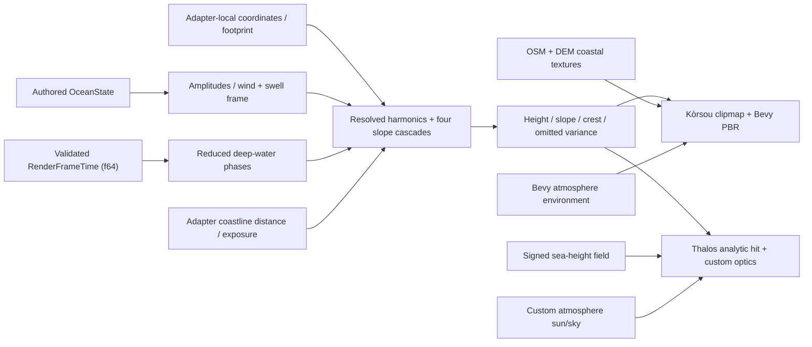

# Ocean rendering

`thalos_ocean` is the shared wave-mechanism leaf for two deliberately different
water adapters. Thalos keeps one analytic planetary surface and signed
sea-height coastline; Kòrsou uses a camera-centred planar clipmap and baked
real-world coastline products. They share authored `OceanState`, a
precision-safe wave clock, resolved surface waves, deterministic spectrum
payload, footprint filtering, omitted-variance transfer, and coastal wave
attenuation. They do not share spatial topology or lighting composition.

The visual target is a low, open-water view with dark blue-green volume,
directional nested waves, a broken sun road, sparse coherent whitecaps, and a
horizon that belongs to the same atmosphere as the sky. BL-12 established those
signals in the shipping analytic projection; OCEAN-1 adds the first authored,
dispersion-aware spectral tracer behind the same filtered-slope seam. Kòrsou
already proves bounded local displacement over that seam. The production
FFT/local-simulation program is still staged rather than implied by these
compact fields.

## 1. Invariants

1. **One surface per spatial adapter:** Thalos's analytic ray/sphere
   intersection owns planet-scale water at every altitude
   (ADR-20260720T185954Z). Kòrsou's bounded camera-relative clipmap owns its
   planar water geometry. Local displacement may decorate either adapter; it
   never becomes a replacement planet-scale sea shell.
2. **One coastline per world:** Thalos's signed sea-height field alone decides
   its coverage and bathymetry (ADR-20260720T185958Z). Kòrsou's baked OSM/DEM
   shoreline products decide its coverage and coastal classes. Shared wave
   functions consume distance/exposure supplied by the adapter and never
   create a competing land/water boundary.
3. **World-anchored phase:** wave phase is fixed in the adapter's stable world
   frame (body-fixed on a planet, recentered projected metres in Kòrsou).
   Camera motion, floating-origin rebases, LOD changes, and render-path swaps
   must not restart or drag the sea.
4. **Energy crosses LODs:** unresolved slope energy becomes BRDF variance.
   Filtering may simplify shape; it must not erase horizon glitter or cause
   temporal sparkle. Ocean footprints are anisotropic at grazing incidence:
   filter the foreshortened view direction without erasing still-resolvable
   cross-view structure (INC-0012).
5. **One light environment:** water consumes the shared sun, atmospheric sky,
   exposure, and aerial perspective. The eventual F7/F9 prefiltered environment
   replaces the current analytic sky approximation without changing ownership.
6. **Foam is coupled to motion:** even the temporary foam source comes from
   exceptional resolved wave steepness and the field's coherent breakup
   signal. Production foam adds Jacobian compression, history, and advection;
   an unrelated scrolling white texture is never acceptable.

## 2. Shipped mechanism and adapters (BL-12 + OCEAN-1 + Kòrsou)

`thalos_ocean` registers `thalos::ocean_waves`, a WGSL library consumed by both
applications. Its functions resolve wave height, slope, crest, spectrum detail,
and omitted variance from adapter-supplied local coordinates, pixel/vertex
footprints, and coast attenuation. The adapters then decide how those signals
affect geometry and light.

| Adapter | Geometry and coast | Lighting/composition | Shared signals consumed |
|---|---|---|---|
| Thalos planetary | Analytic ray/sphere hit plus the canonical signed sea-height field; no planet-scale mesh | `BodyOceanMaterial` / `body_sky.wgsl`, custom atmospheric sun/sky, depth optics, and pinned composite ordering | Resolved slope/crest, spectrum slope, footprint filtering, omitted variance, canonical phases. Surface height is projected but does not yet move the analytic horizon. |
| Kòrsou planar | Thirteen camera-centred clipmap levels, 2 m nearest spacing, real vertex displacement, baked signed shoreline and coastal-property textures | Bevy `ExtendedMaterial<StandardMaterial, _>` with the atmosphere-generated environment | Resolved height/slope/crest, spectrum slope, footprint filtering, omitted variance, canonical phases, coastal attenuation. |

| Signal | Current implementation |
|---|---|
| Ocean state | `thalos_world::OceanState` is the authored sea-state interface: body-local wind/swell axes, 10 m wind speed, significant wave height, dominant wavelength, swell energy, deep-water optics, and foam onset. Thalos loads it per body; Kòrsou currently uses `OceanState::MODERATE`. |
| Resolved surface waves | Three calibrated deep-water harmonics project wavelength, amplitude, and f64-reduced phase. Shared WGSL returns height, slope, crest, and footprint-omitted variance. Kòrsou consumes height in its clipmap vertices; Thalos consumes slope/crest/variance while retaining its analytic hit. |
| Spectrum slopes | One shared 256² RGBA8 texture stores deterministic low- and high-frequency directional packets (128 unique Fourier carriers each). Four overlapping physical domains (8192, 1024, 128, and 16 m) provide swell through capillary detail without exposing a handful of carriers. |
| Evolution | Each cascade samples both packets. CPU derives their representative deep-water phase velocities `sqrt(gλ/2π)` from body gravity and advances phase from canonical simulation time, so pause/time warp and captures share one clock. This is a measured two-packet tracer, not a JONSWAP/TMA claim. |
| Precision | CPU reduces every spectral and resolved-wave phase in f64 before upload. Thalos additionally computes a modulo-8192 m body-fixed camera phase; Kòrsou's recentered UTM frame remains within tens of kilometres. |
| Distance filtering | The texture carries a full CPU-authored mip chain and a 16× anisotropic repeat sampler. Both adapters provide surface-footprint gradients to `textureSampleGrad`; unresolved spectrum and harmonic slope energy becomes GGX variance rather than disappearing. |
| Coast response | Shared `ocean_coastal_wave_scale` turns adapter-supplied water distance, range, and exposure into contact attenuation, protection, and a breaker-band shoaling gain. Each adapter retains its own coastline sampling and foam/volume policy. |
| Reflection and transmission | Thalos combines dielectric Fresnel/GGX with its custom atmospheric sun/sky and signed-field water column. Kòrsou combines the resolved normal/roughness with Bevy PBR, its atmosphere environment, and its real-data shelf/shore textures. |
| Foam | Both adapters couple open-water foam to resolved slope/crest and coherent spectrum breakup. Their shoreline foam differs because the available coastline/bathymetry data differs. Neither has persistent advected foam history yet. |

The compatibility `shade_ocean` entry remains for map/far callers. It supplies
a neutral resolved slope and the statistical roughness of the unresolved sea,
so those projections do not invent a second phase model.

## 3. Data flow



Mechanism lives in `thalos_ocean`; applications resolve pause/warp policy into
the Bevy-free `RenderFrameTime`, then `thalos_ocean` projects its current and
previous epochs with authored state into precision-safe Rust payloads and
registers its `thalos::ocean_waves` shader library. In Thalos,
`BodySkyMaterial` and `BodyOceanMaterial` still
compile one optical shader with mutually exclusive atmosphere/ocean definitions
and share one bind implementation, so the signed-field lookup and custom
optical path cannot drift. Kòrsou imports the same wave library into its planar
material but retains its own coastline and Bevy PBR bindings. This is the
spatial-adapter decision in ADR-20260808T221912Z, not a universal renderer
interface.

## 4. Verification

Run:

```bash
just screenshot ocean
```

The preset searches Thalos for water deeper than 250 m under a 10–32° sun,
then places the real `ShipCamera` 600 m from the sea focus at 1.5° elevation and
22° off the specular axis. It renders 1920×1080 to
`artifacts/visual/latest/ocean.png` through the real atmosphere, cloud, depth, ocean,
and post stack.

The acceptance read is:

- irregular nested wave structure with no closed noise-gradient contours or
  straight lattice/crosshatch;
- dark volume outside an off-centre broken sun road;
- short detail in the foreground and statistically stable energy at the horizon;
- no phase swimming implied by planet-scale f32 coordinates;
- no regression to hardcoded blue sky reflection or independent foam noise.

BL-12 was recaptured and inspected on 2026-07-21 after the INC-0012 correction;
OCEAN-1's deterministic phase-0 production capture is
`artifacts/visual/latest/ocean.png` and its evolved phase-45 capture is
`artifacts/visual/latest/ocean_t45.png`. Both retain foreground and horizon detail.

To inspect the field without the sun road or BRDF hiding topology, run:

```bash
just screenshot ocean-slopes
THALOS_SCREENSHOT_OCEAN_TIME=45 just screenshot ocean-slopes
```

The false-colour view maps resolved tangent slope to red/green and the
mip-omitted-variance GGX handoff to blue. `THALOS_SCREENSHOT_OCEAN_TIME`
provides a deterministic f64 phase override for ocean probes only. The
phase-0/phase-45 diagnostic pair (`ocean_slopes_t0.png`,
`ocean_slopes_t45.png`) changes materially across the full water field while
the scene remains fixed (RMSE 0.024 on the verified captures), demonstrating
differential packet motion instead of one rigid texture translation.

Verify the planar adapter through its real headless application path:

```bash
cargo run -p korsou --features dev-renderer -- \
  capture artifacts/korsou/ocean.png \
  --viewpoint "Reference - Grote Knip beach" --size 1920x1080
```

That capture must retain displaced nearby silhouette, a stable clipmap handoff,
shore attenuation against the baked coastline, and no WGSL import/pipeline
errors. Other saved references cover exposed cliffs, reefs, close coastline,
and north-coast waves; see `apps/korsou/README.md`.

## 5. Calibration ownership

`OceanState` is the sole per-body sea-state authoring surface. The current
projection consumes its physical spectrum controls, directions, optics, and
foam onset while preserving BL-12's accepted calm/moderate amplitudes at the
reference state. Shader constants that describe the fixed packet layout are
mechanism, not presets. Do not scatter screenshot-specific appearance values;
the screenshot time override changes phase only.

## 6. Production rendering path

The cross-discipline product program now lives in
[`roadmap/ocean_systems.md`](../roadmap/ocean_systems.md) (`sea §N`). This
section owns the rendering mechanism inside that program; `OCEAN-2` through
`OCEAN-7` in `backlog.jsonl` are its execution slices. The local displacement and
physics work do not reopen the analytic global surface or the one signed
coastline.

1. **State and observability (partly landed in OCEAN-1).** Per-body
   `OceanState`, canonical-clock phase reduction, representative packet-speed
   logs, and the slope/variance headless view are live. GPU timestamps and
   slowly interpolated weather-state changes remain for the compute-field
   implementation.
2. **Spectral fields.** Replace the static baked slope texture behind the same
   sampling seam with deterministic JONSWAP/TMA evolution. Start with four
   non-duplicating 128²–256² cascades and produce packed displacement/height
   plus slope/Jacobian textures. Measure before increasing grid size.
3. **Local displacement.** Kòrsou ships the first bounded implementation: a
   snapped camera-relative clipmap using the shared resolved-wave height and
   footprint filtering. Thalos may add a body-tangent equivalent over its
   analytic planet surface, transferring omitted variance to the BRDF and
   fading displacement before the analytic-only region. Jacobian-aware
   clamping prevents folds. The Kòrsou adapter proves the mechanism, not the
   planetary composition.
4. **Persistent foam.** Advect and decay a body/world-anchored foam-density/age
   field. Sources are spectral Jacobian compression, vertical motion, BL-10
   shore breaking, and later vessel/impact events. The BL-12 crest term becomes
   the source input, not the displayed history.
5. **Bounded interaction.** Add shallow-water tiles only near relevant coasts,
   vessels, or authored zones. Feed spectral boundary height/velocity in and
   blend energy back out. Wakes combine a cheap far Kelvin pattern with local
   impulses and foam sources.
6. **Reflection hierarchy.** Keep atmosphere sky + analytic sun as the
   everywhere fallback; add the shared F7/F9 prefiltered environment, then judge
   SSR/Hi-Z or local probes by measured visual value. Every optional tier blends
   by confidence and may never leave black reflection holes.

The first production gate is `sea §5`'s Thalos proving slice, not isolated
wave/foam demos. It must demonstrate geometry, filtering, foam history,
reflection fallback, vessel response, local coast coupling, weather forcing and
GPU budget across the same deterministic route.

## 7. Deliberate limits of the planetary adapter and shared mechanism

- Thalos has no displaced wave geometry or changed analytic horizon silhouette;
  Kòrsou does have bounded local displacement.
- No persistent foam/advection/age field.
- No vessel buoyancy, Kelvin wake, impact injection, or spray.
- No local shallow-water solver beyond BL-10's visual shoaling/refraction model.
- No SSR or scene reflection; atmosphere sky and sun are the stable fallback.
- OCEAN-1's two frequency packets per cascade approximate dispersion; they do
  not evolve every Fourier mode independently or produce spectral displacement
  or Jacobian fields. The shared three-harmonic resolved wave does provide a
  compact height/slope/crest signal, but it is not an FFT claim.

These are explicit `OCEAN-2` through `OCEAN-6` scope, not hidden TODOs in the
shader.

## References

- [ADR-20260808T221912Z-atmosphere-and-ocean-mechanisms-use-spatial-adapters](../adr/20260808T221912Z-atmosphere-and-ocean-mechanisms-use-spatial-adapters.md)
- [ADR-20260808T205119Z-korsou-second-application-render-kit](../adr/20260808T205119Z-korsou-second-application-render-kit.md)
- [ADR-20260720T185954Z-analytic-planet-water-never-meshed](../adr/20260720T185954Z-analytic-planet-water-never-meshed.md)
- [ADR-20260720T185958Z-water-projects-one-signed-sea-field](../adr/20260720T185958Z-water-projects-one-signed-sea-field.md)
- [ADR-20260721T050036Z-ocean-composite-independent-of-atmosphere](../adr/20260721T050036Z-ocean-composite-independent-of-atmosphere.md)
- [INC-0012](../incidents/0012-ocean-gradient-worms-isotropic-detail-loss.md)
- [Atmospheres, Oceans, and Lighting](atmosphere.md)
- [Graphics fidelity plan](../roadmap/graphics_fidelity.md)
