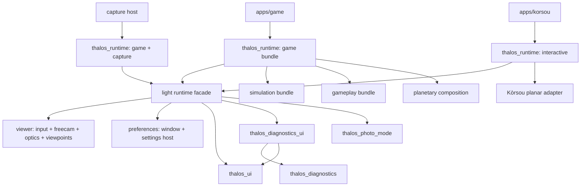

# Lightweight capability-selected application runtime (`app`)

**Status:** active architecture plan · **Started:** 2026-08-09
**Decision:**
[ADR-20260809T201216Z-light-runtime-capability-bundles](../adr/20260809T201216Z-light-runtime-capability-bundles.md)
**Cross-ref prefix:** `app §N`

This document is strategy and sequencing. `docs/backlog.md` remains the sole
execution-status authority.

## §1 Outcome

The Thalos project's applications share one small, polished application runtime
without making simulation or gameplay the price of admission. The game remains
the primary product; the common shell lets other real applications use the
world foundation without becoming game modes.

- `apps/game` enables the complete game capability bundle and is the release
  integration target.
- `apps/korsou` enables the interactive shell and its chosen rendering leaves,
  but no simulation or gameplay.
- headless tools enable capture explicitly.
- a disabled capability is absent from the dependency graph and binary.

Kòrsou should therefore have the normal freecam and its UI, camera optics,
saved-viewpoint workflow, window and graphics settings, UI language,
diagnostics, and eventually the common capture mechanism. It remains a planar
real-world explorer and continuing passion project, not a planetary simulation
scenario or disposable test client. A future web target is plausible, but it is
not a current runtime requirement and does not justify speculative platform
abstraction.

## §2 Baseline at plan start

The first Kòrsou slice correctly proved rendering reuse and explicit spatial
adapters. Its application shell is still bespoke:

| Concern | Kòrsou today | Canonical game today |
|---|---|---|
| Camera | `apps/korsou/src/camera.rs`, raw input, planar DEM constraints | `freecam`, physical optics, semantic input, body-fixed pose |
| Camera UI | compact status HUD | `thalos_ui` freecam panel and input gates |
| Saved views | private schema, JSON store, Bevy UI | capture-protocol schema, F8 manager, F9 quick-save, scripted views |
| Settings | shared persisted window/graphics surface; planar foliage adapter | shared persisted window/graphics plus game-only units/HUD settings |
| Capture | local screenshot state machine | canonical capture protocol, host, receipts, and health checks |

This is demonstrated duplication, so extracting the shared interaction
mechanisms is not speculative framework work.

## §3 Target dependency shape



The facade selects plugin bundles. It does not contain their implementations.
Simulation and gameplay keep moving out of the current runtime monolith under
ADR-20260731T024003Z.

## §4 Capability contract

The product-level capabilities are fixed:

| Capability | Owns | Dependency rule |
|---|---|---|
| base, always present | builder, capability validation, minimal Bevy composition glue | no simulation, gameplay, planetary, or capture dependency |
| `interactive` | semantic view input, shared UI assets, F1 clean-view mode, freecam/optics, viewpoints, window/settings host | usable with either planar or planetary spatial adapter |
| `simulation` | canonical clock/state bridges, orbital/control/local-physics drivers | no HUD, map, editor, or player-flow dependency |
| `gameplay` | player controllers, HUD/map/editor/structures, scenarios and flow | additive over `simulation` |
| `planetary` | Thalos world projection and planetary rendering integration | independent of Kòrsou's planar adapter |
| `capture` | headless orchestration, protocol bridge, readiness/health/receipts | explicit for tools; does not become part of the light interactive default |
| `game` | convenience bundle for the canonical player application | `interactive + simulation + gameplay + planetary` |

APP-0 implements the supported manifest surface as `interactive`, `game`, and
`capture`. The existing complete composition now lives in the explicitly named
`thalos_game_runtime` package, and the thin `thalos_runtime[game]` facade is its
only application-facing edge. `simulation`, `gameplay`, and `planetary` are
already reported as product capabilities of that bundle, but do not become
independently selectable Cargo features until their implementations sit behind
honest crate/plugin boundaries. An empty feature that merely claimed one of
those subsets would make the manifest lie about the binary.

APP-1 and APP-2 give `interactive` its first implementation dependencies:
`thalos_preferences` and `thalos_viewer`; the later shared clean-view slice adds
`thalos_photo_mode`. All remain light and terminate at Bevy, `thalos_ui`, and
the Bevy-free render model; the executable guard rejects
any simulation, gameplay, HUD, map, editor, local-physics, or capture-runtime
edge.

Rules:

1. `thalos_runtime` has no default features. Every application names what it
   contains.
2. Feature flags are coarse, additive selectors over optional crate
   dependencies. They are not sprinkled through implementation systems.
3. Runtime graphics choices stay data. MSAA, foliage, clouds, and future
   quality controls are persisted settings exposed only when the application
   supplies that capability.
4. All supported combinations type-check in CI. The light Kòrsou graph has
   explicit forbidden-dependency assertions for simulation and gameplay.
5. Capability startup emits one structured summary so a capture receipt or
   runtime diagnostic identifies the exact composition.

## §5 Shared interaction seams

### §5.1 Viewer

One viewer mechanism owns camera intent, freecam motion, physical optics, the
freecam panel, and exact-pose handoff. An application adapter supplies:

- conversion between its stable f64 frame and the rendered camera transform;
- local up and optional ground-floor query;
- optional playable-volume constraints;
- its current human-readable location/anchor identity.

The planar adapter uses recentered EPSG:32619 metres and the DEM. The planetary
adapter uses a latched body-fixed pose projected through the current body state
and floating origin. Simulation pause/warp policy remains a game-side
integration, not a viewer assumption.

Kòrsou's geographic place catalog remains an application spatial adapter: it
projects attributed WGS84 entries into the same local UTM frame, supplies the
current location label to the shared viewer panel, and projects selected POIs
back through the planar/ellipsoid render adapter. The viewer owns neither GIS
data nor game navigation semantics.

### §5.2 Viewpoints

One catalog/store/UI core owns identity, metadata, validation, CRUD, F8, F9,
and headless selection. A saved pose names its spatial frame and carries the
camera pose plus optics. The adapters capture and apply that pose:

- projected-local for Kòrsou;
- authored body-fixed for Thalos.

Scripted diagnostic views remain application capabilities selected by stable
driver names. They appear in the same public catalog but do not leak
game-specific scenario types into the common store.

### §5.3 Preferences and graphics settings

The common settings host owns file location, schema/versioning, atomic save,
window/display settings, UI scale, the settings-menu frame, and shared graphics
fields proven across applications. Application plugins contribute only the
typed controls they implement. Unsupported controls are absent, not disabled
noise.

The first common graphics tracer was MSAA because both applications use Bevy
cameras and the setting has one concrete meaning. Foliage is now the second:
`GraphicsPreferences::foliage` parks and clears either application's woody
foliage streamer while leaving terrain colour and the game's separate grass
layer unchanged. The control is registered only when the application supplies
a foliage adapter, so Kòrsou's ellipsoid mode does not show an inert setting.
Planetary-only clouds, grass, terrain LOD, and shadow-cascade count remain
game settings until a second real consumer exists.

Named quality presets (Showcase / Laptop / Custom) live in the shared
graphics schema and stamp both shared and game knobs. Laptop is a developer
profile, not a shipping Low preset: first run on macOS defaults to it, capture
always uses Showcase, and `THALOS_QUALITY` pins one session without writing
the file. Contract: `docs/development/quality_profiles.md`.

### §5.4 Capture and diagnostics

Both applications use the machine-wide renderer lease and unified diagnostics.
F3 is one lightweight `thalos_diagnostics_ui` surface: it owns the toggle,
availability gate, wall-clock CPU/GPU history, common renderer/process facts,
panel shell, and graph. Typed ECS extensions populate its application area.
Kòrsou contributes planar terrain/foliage streaming and projected position;
the game contributes its deeper simulation, memory, planetary, and debug-draw
fields. The game perf recorder consumes the same shared frame history, keeping
the live screen and structured perf lane on one authority without pulling game
systems into the lightweight composition
(ADR-20260810T191952Z).
The capture mechanism should share request identity, render-target/readback,
shader/pipeline health, provenance, and receipts. Scene selection, readiness,
and spatial framing are application adapters. The Thalos capture host remains
the acceptance path for the game; Kòrsou does not masquerade as a cheaper game
renderer.

### §5.5 Photo mode

F1 is one lightweight `thalos_photo_mode` clean-view capability. It owns the
state, the opt-in overlay marker, and visibility arbitration, including exact
restoration of an overlay's prior visibility. Applications retain only their
input adapter and modal gates. Thalos keeps its remappable F1/P action;
Kòrsou reads F1 directly. Camera movement remains available in both apps while
ambient viewer/location UI, diagnostics, toasts, and marked scene overlays
stay hidden. Explicit modals may still open and close over the clean view.

## §6 Source-boundary direction

Use the smallest crate set that enforces the dependency rule:

```text
crates/interface/
  diagnostics_ui/ # shared F3 state, frame history, panel/graph, extension seam
  photo_mode/    # shared F1 state, overlay marker, visibility arbitration
  viewer/        # camera intent, freecam, optics, panel, viewpoint core/UI
  preferences/   # window/settings persistence and modular settings surface
  input/         # existing semantic input
  ui/            # existing visual kit and shared assets

crates/runtime/
  app/           # thalos_runtime: empty-default capability facade
  game/          # thalos_game_runtime: transitional complete composition
```

`viewer` owns camera motion, optics, and the saved-viewpoint core/UI because
exact saved views, optics, and freecam handoff form one proven state machine.
World-specific capture/apply adapters stay with their application/runtime
integration.

## §7 Execution sequence

Each slice removes a parallel path in the same change. No slice leaves a new
shared mechanism beside both old implementations.

| Slice | Scope | Exit gate | Estimated tokens |
|---|---|---|---:|
| **APP-0 — light facade and feature graph** | Establish the empty-default capability facade, move unconditional imports behind optional crate bundles, make the game explicitly select `game`, and add feature-matrix/dependency guards | base and `interactive` check without simulation/gameplay; complete game and capture builds retain behavior | 30k–60k |
| **APP-1 — common preferences** | Extract window persistence, UI scale, settings-menu host, and MSAA tracer; adopt from game and Kòrsou | one settings implementation; Kòrsou opens the normal UI; persisted settings and headless overrides remain isolated | 40k–70k |
| **APP-2 — shared viewer/freecam** | Extract camera intent, optics, freecam controller/panel, and planar/planetary adapter seam; replace Kòrsou camera movement | matched controls/UI in both apps; planar floor/bounds and planetary body-lock tests; no duplicate controller | 50k–90k |
| **APP-3 — unified viewpoints** | Generalize the catalog pose frame, extract CRUD/F8/F9 UI and replay core, add projected/body-fixed adapters, migrate Kòrsou data | one schema/store/UI; both existing catalogs migrate; interactive save/replay and headless named capture pass | 45k–80k |
| **BL-20260810T191952Z — shared F3 diagnostics** | Extract common F3 intent, frame history, panel/graph, and typed extension seam; migrate both applications and retain game telemetry/debug adapters | identical common surface in both apps; application fields remain typed and lightweight graph stays clean | 35k–60k |
| **APP-4 — common capture shell** | Share request/readback/health/provenance/receipt machinery while retaining application readiness/framing adapters | Kòrsou and game receipts share the contract; pipeline failures cannot exit successfully in either lane | 40k–80k |
| **APP-5 — consolidation** | Delete superseded Kòrsou HUD/camera/viewpoint/capture plumbing, collapse facade shims, document supported feature sets | Kòrsou source is world/adapter composition only; forbidden dependency and binary/dependency-size report pass | 20k–40k |

APP-0 is the gate. Its executable guard is
`bash scripts/check_runtime_capabilities.sh`. APP-1 landed the
`thalos_preferences` crate and removed the game's separate window module plus
Kòrsou's fixed-window path. Its shared graphics schema now owns MSAA and the
foliage toggle consumed by both foliage adapters. APP-2 landed `thalos_viewer`, moved the optics model
below capture, replaced Kòrsou's motion controller, and retained only explicit
planetary and planar projection/constraint adapters. APP-3 moved the
frame-tagged catalog model below capture, put persistence and F8/F9 UI in the
viewer, migrated both catalogs to v3, and deleted both application UI/store
forks. The shared F3 diagnostics slice now removes the second demonstrated
interactive-shell fork: the common ring/panel/graph live in
`thalos_diagnostics_ui`, and both former application shells have been replaced
by typed extension plugins. Its code/test/dependency gates are complete; live
layout and shader output remain at `verify` because the headless host exposed
no GPU.
APP-4 stays later because the canonical capture path is scenario-coupled
and load-bearing.

## §8 Verification matrix

| Concern | Required evidence |
|---|---|
| Feature absence | `cargo tree` guard: Kòrsou has no simulation/gameplay/local-physics/HUD/map/editor crates |
| Feature combinations | checks for base, `interactive`, `game`, and `game + capture`; no power-set matrix |
| Build fingerprint | all renderer-bearing combinations keep the one `dev-renderer` Bevy/wgpu feature set |
| Viewer | pure pose/input tests plus planar and body-fixed adapter tests; user flythrough in both apps |
| Viewpoints | schema migration, invalid-frame rejection, CRUD round trips, exact optics/pose replay |
| Diagnostics | shared ring/stat/toggle tests; perf event schema unchanged; capability guard; matched F3 common surface plus typed app fields in both apps |
| Preferences | load/default/migration/atomic-save tests; controls appear only for supplied capabilities |
| Visual/UI | `just ui-preview`, Kòrsou headless coastal/aerial captures, and relevant Thalos presets |
| Weight | dependency-count and release-binary-size receipts before/after Kòrsou migration; regressions require an explained capability |

## §9 Non-goals

- Making Kòrsou a planetary simulation scenario.
- Treating Kòrsou as only an architecture harness rather than its own focused
  application.
- Making a possible future web target part of the current capability contract.
- Hiding simulation/gameplay behind runtime booleans while still compiling and
  linking them.
- A feature flag per Bevy plugin, graphics toggle, or quality choice.
- Replacing explicit planar/planetary/ellipsoid render adapters with one world
  interface.
- A plugin ABI, runtime module downloader, or third-party extension system.

## §10 Next implementation handoff

APP-4 can begin at the application-neutral capture transaction: renderer lease,
request identity, target/readback, pipeline-health verdict, provenance, and
receipt. Keep game scenario readiness/scripted drivers and Kòrsou terrain
settling/spatial framing as explicit adapters; do not make capture part of the
interactive default.
