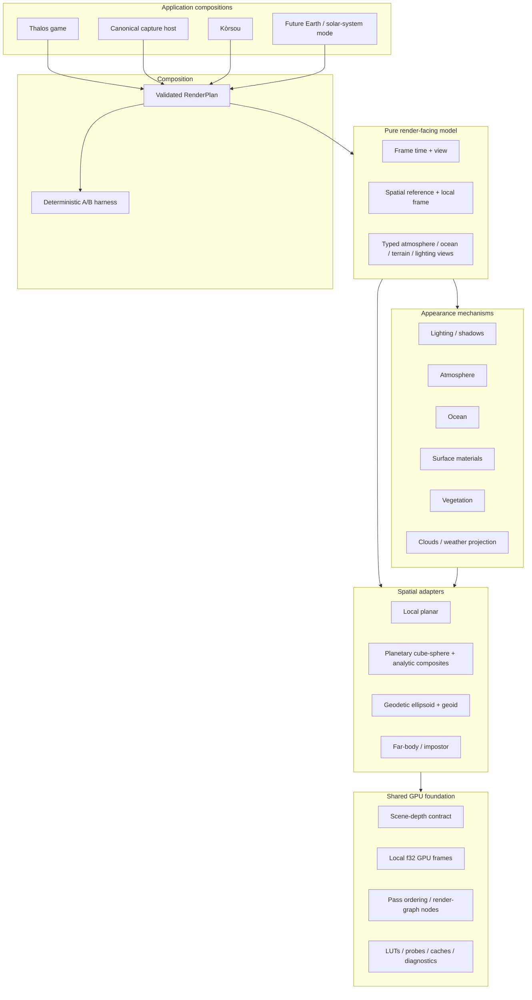

# Flexible render-kit architecture (`rkit`)

**Status:** implemented · **Started:** 2026-08-08 · **Completed:** 2026-08-09
**Decisions:**
[ADR-20260809T201216Z-light-runtime-capability-bundles](../adr/20260809T201216Z-light-runtime-capability-bundles.md),
[ADR-20260808T221912Z-atmosphere-and-ocean-mechanisms-use-spatial-adapters](../adr/20260808T221912Z-atmosphere-and-ocean-mechanisms-use-spatial-adapters.md)
**Superseded baseline:**
[ADR-20260808T205119Z-korsou-second-application-render-kit](../adr/20260808T205119Z-korsou-second-application-render-kit.md)
**Cross-ref prefix:** `rkit §N`

This document is strategy and sequencing. `docs/backlog.jsonl` remains the sole
execution-status authority (`just queue`).

## §1 Outcome

The Thalos project maintains a flexible internal rendering foundation used by
several feature-selected application compositions without turning simulation
or gameplay into a prerequisite. It is the rendering part of the personal world
engine defined in [Project purpose](../purpose.md), not a separate public SDK:

- the primary Thalos game: planetary bodies, physics, gameplay, orbital
  simulation, and the release integration target;
- Kòrsou: a continuing lightweight real-world explorer and focused laboratory;
- future real-Earth/solar-system modes: ellipsoid, explicit horizontal and
  vertical datums, geoid, and streamed geospatial content;
- canonical headless capture and deterministic A/B evaluation.

The organizing model is:

> Authored world state describes reality. Applications project it into small,
> immutable render inputs. Shared mechanisms describe appearance. Explicit
> spatial adapters describe geometry, precision, and composition. A validated
> render plan selects one compatible implementation for each required
> capability.

The goal is replaceability without false uniformity. There is no universal
`Renderer` trait hiding planar, spherical, and ellipsoidal topology.

Kòrsou may deepen oceans, coasts, foliage, and other natural-world systems in a
fresh constrained composition. General mechanisms return to this foundation
only when their semantics match another real consumer; Kòrsou-specific
geography, topology, and product behavior remain in its adapter. The same rule
applies to any future application such as an RTS.

## §2 Baseline established on 2026-08-08

Kòrsou now lives in the Thalos workspace as a second application and selects
only `thalos_runtime[interactive]`; that facade is dependency-empty today, so
Kòrsou still has no simulation or gameplay crates in its graph. Three shared
rendering leaves have two concrete consumers:

- `thalos_atmosphere`: authored planetary `AtmosphereBlock` projection plus a
  concrete Bevy Earth adapter for planar worlds;
- `thalos_ocean`: `OceanState` projection, precision-safe wave phases,
  resolved wave height/slope/crest, deterministic spectrum payload,
  anisotropic filtering, omitted variance, and coastal attenuation;
- `thalos_vegetation`: topology-independent woody payloads plus the shared
  hemisphere-octahedral atlas bake, generic standard-path material, bounds, and
  four-vertex root batching used by both Kòrsou and Thalos.

Their spatial adapters remain distinct:

| Application | Terrain | Atmosphere | Ocean | Coordinates |
|---|---|---|---|---|
| Kòrsou | RTIN through planar or geodetic-ellipsoid placement | Bevy Earth | Displaced camera-centred clipmap in planar mode | Recentered UTM metres or WGS84/EGM2008 → ECEF → local ENU |
| Thalos | Cube-sphere tiles; UDLOD only in an opt-in comparison build | Custom scene-depth-aware planetary raymarch | Analytic sphere and signed sea-height field | Body-fixed f64 plus floating origin |

This was the first proof that Thalos can expose rendering mechanisms without
exposing its full game graph. Kòrsou now consumes the lightweight
`thalos_runtime[interactive]` facade while remaining free of simulation and
gameplay (ADR-20260809T201216Z; `app §3`–`§4`). At this baseline,
`thalos_body_render` still mixed shared GPU foundation, planetary composites,
far-body projection, cube-sphere terrain, legacy terrain, vegetation placement,
and construction appearance; RK-2 through RK-6 below resolved those seams.

## §3 Target dependency shape



Dependencies point down this diagram. In particular:

- rendering never imports `thalos_runtime`, gameplay, or physics-runtime
  types;
- the lightweight application facade may select rendering leaves, but its
  disabled simulation/gameplay capabilities remain absent from Kòrsou's graph;
- applications may translate their own state into render inputs;
- adapters may consume mechanisms, never the reverse;
- the GPU foundation knows passes and resources, not planets or gameplay;
- the capture host composes the same plan as the Thalos game rather than a
  simplified verification renderer.

## §4 Non-negotiable invariants

### §4.1 One authored authority

Physical body/environment values stay in pure domain crates. Rendering may
cache or project authored data; it never reparses or reauthors it. Simulation
state and Kòrsou's local exploration state are application inputs, not rendering
dependencies.

### §4.2 One mechanism per signal

Wave phase, atmosphere coefficients, sun irradiance, surface material response,
and vegetation appearance each have one mechanism. Adapters decide how a
signal is represented spatially, not what that signal means.

### §4.3 Spatial differences remain explicit

Planar projected terrain, body-fixed cube spheres, analytic planet surfaces,
far-body impostors, and datum-aware ellipsoids are concrete adapters. Do not
compress them into an interface that requires topology-specific escape hatches.

### §4.4 Precision is part of the adapter contract

World/body/geodetic positions stay f64 until the adapter constructs a bounded
local GPU frame. WGSL receives f32 positions only after translation into that
frame. Every adapter documents its stable frame, rebase behavior, and maximum
f32 extent.

### §4.5 Geometry authorities stay singular

- One terrain tile/source authority feeds visible geometry, height queries,
  collision, and placement at each fidelity band.
- Thalos keeps one analytic planet-scale ocean and one signed sea field.
- Local displaced ocean geometry is bounded and fades into the analytic
  authority.
- Kòrsou's projected coastline remains its local coverage authority.

### §4.6 Swappability is measured

An implementation is swappable only when the same render inputs, clock, camera,
capture settings, and acceptance metrics can evaluate it against another
implementation. A common trait without deterministic A/B evidence does not
count.

### §4.7 Fidelity parity crosses adapter boundaries

Kòrsou and Thalos target mostly consistent rendering fidelity even where their
spatial adapters cannot share topology. Each relevant application must provide
the same class of perceptual evidence: resolvable terrain and material breakup,
one visible and time-varying sun, grounded foliage/structure shadows, coherent
sky and environment response, and compatible exposure. The exact mesh,
atmosphere projection, cascade reach, or distant handoff may remain
adapter-specific.

A fidelity gap is a renderer defect or an explicit product tradeoff with
evidence; it is not an accepted consequence of Kòrsou being lightweight.
Mechanisms should move into shared leaves once two adapters genuinely share
their meaning, while calibration and spatial representation stay local.

## §5 Render-facing model

The render-facing model is a small immutable snapshot vocabulary, not a second
ECS world and not one ever-growing `RenderWorldSnapshot` god struct.

Grow it as typed records whose consumers are proven:

- frame time: current and previous f64 epochs, pause/warp semantics already
  resolved by the application;
- view state: current and previous f64 origin plus the stable spatial frame in
  which it is expressed;
- environment views: renderer-neutral projections of authored atmosphere,
  ocean, lighting, weather, and visible-body state;
- spatial reference: enough information for one adapter to construct a local
  frame, never hidden assumptions such as `Y == ellipsoid height`.

The first implementation must be a tracer through two real consumers. Do not
create unused coordinate hierarchies in anticipation of Earth mode.

For future real-Earth support, the vocabulary must eventually distinguish:

- geodetic latitude/longitude/ellipsoid height;
- ECEF or equivalent body-fixed Cartesian position;
- orthometric height and its named geoid/vertical datum;
- projected horizontal CRS;
- a bounded local ENU/render frame.

Those distinctions land with the ellipsoid adapter, not as speculative enums
in the first slice.

## §6 Mechanisms and adapters

### §6.1 Mechanism interface

A mechanism owns renderer-independent meaning and GPU payloads that match
across adapters. Examples:

- ocean phase and spectral projection, resolved wave shape, filtering, and
  variance transfer;
- atmosphere authored projection and optical coefficient layouts;
- surface BRDF libraries and lighting inputs;
- foliage mesh/atlas construction;
- cloud weather projection and shared optical coefficients.

A mechanism does not choose scene entities, streaming topology, coordinate
rebases, pass ordering, or application state.

### §6.2 Spatial adapter interface

An adapter owns:

- coordinate conversion and precision frame;
- geometry topology and LOD/streaming;
- coastline/terrain spatial queries;
- material binding into a concrete renderer path;
- composition with scene depth and render passes;
- adapter-specific diagnostics.

Concrete target adapters:

- `LocalPlanar`: projected metre worlds, planar terrain/clipmaps;
- `Planetary`: cube-sphere terrain plus analytic atmosphere/ocean composites;
- `GeodeticEllipsoid`: ECEF/geodetic/datum-aware real-world globe;
- `FarBody`: orbital/far-field impostors.

The same application may compose more than one adapter by range—for example,
`Planetary` near a body and `FarBody` for distant bodies.

## §7 Declarative composition and A/B testing

`RenderPlan` is startup composition and validation, not a hot-loop dynamic
dispatch interface. A representative shape is:

```rust
RenderPlan {
    terrain: TerrainAdapter::CubeSphereTiles,
    atmosphere: AtmosphereAdapter::PlanetaryRaymarch,
    ocean: OceanAdapter::AnalyticPlanet {
        local_displacement: Some(LocalOceanAdapter::TangentClipmap),
    },
    far_body: FarBodyAdapter::Impostor,
}
```

The real type should emerge from existing plugin/resource requirements. It must
validate incompatible combinations at startup and emit a structured summary of
the selected plan. Initially, switching is restart-time only. Live switching
is a separate product requirement and is not justified today.

Runtime configuration selects among implementations already compiled into the
binary. Cargo features remain for platform/dependency availability, not ordinary
quality comparisons.

Every selectable implementation declares:

- capability supplied;
- required spatial frame and upstream inputs;
- owned passes/resources;
- compatibility constraints;
- deterministic capture probes;
- GPU timing and memory diagnostics where material.

## §8 Target source layout

This is an ownership map, not a demand for one crate per box. Begin with modules;
split a crate only for a cheaper edit loop, compiler-enforced dependency rule,
standalone harness, or agent-isolation payoff.

```text
crates/rendering/
  model/                 # pure render-facing types; no Bevy
  kit/                   # thin validated RenderPlan composition facade
  foundation/            # shared GPU passes, scene depth, local frames, diagnostics
  atmosphere/            # atmosphere mechanism + concrete projections
  ocean/                 # ocean mechanism + shader library
  vegetation/            # reusable foliage payloads
  shading/               # lighting and surface optical libraries
  adapters/
    planar/              # module first; Kòrsou may remain its only composition
    planetary/           # cube-sphere + analytic planetary composites
    ellipsoid/           # future ECEF/geodetic/geoid adapter
    far_body/            # impostors and orbital projections
```

Evolution implemented by RK-2 through RK-6:

- `thalos_body_render::tiles` is the planetary cube-sphere terrain adapter;
- `thalos_body_render::ground` is split between `GroundAppearancePlugin` and
  the feature-gated `LegacyUdlodPlugin`;
- `PlanetaryRenderPlugin` and `FarBodyRenderPlugin` expose concrete adapters
  without an all-in-one compatibility facade;
- scene depth is the first proven GPU-foundation seam: the foundation owns the
  selected-view marker, sampleable image lifecycle, copy/MSAA-resolve, shader,
  and opaque-to-transparent ordering; shadow, LUT, probe, and other pass
  mechanisms move only when their existing consumers prove equally narrow
  interfaces;
- `thalos_render_kit` owns validated plan composition while applications
  consume it and concrete adapter leaves intentionally;
- `thalos_udlod` is sealed behind the optional, default-off
  `legacy-udlod` capability while A/B evidence still needs it; deletion is a
  later cleanup once that evidence no longer pays for the maintenance edge.

## §9 Execution sequence

Token estimates are scope signals, not commitments. Each slice must land as a
vertical tracer with tests and documentation; no slice may leave unused target
types or parallel authorities.

| Slice | Scope | Exit gate | Estimated tokens |
|---|---|---|---:|
| **RK-0 — shared leaves** | Atmosphere, ocean, and vegetation mechanisms consumed by Kòrsou and Thalos | Compile, unit tests, and both GPU captures pass | Landed |
| **RK-1 — render-input tracer** | Introduce the smallest Bevy-free render-facing time/view vocabulary justified by two callers; route one ocean tracer through both applications | No runtime/gameplay dependency; no unused types; deterministic phase/capture parity | 15k–30k |
| **RK-2 — adapter inventory and GPU-foundation seam** | Classify every `thalos_body_render` module/resource/pass as mechanism, foundation, planetary, far-body, or legacy; extract one proven foundation seam | Dependency graph tightens; standalone consumer test; no behavior change | 20k–40k |
| **RK-3 — planetary/far-body split** | Separate cube-sphere terrain, analytic planetary composites, and far-body projection behind their existing concrete plugin seams | Thalos game/capture compile and visual probes match; Kòrsou's light graph remains free of simulation/gameplay | 35k–70k |
| **RK-4 — validated RenderPlan** | Replace scattered plugin/toggle composition with startup capability selection and structured plan diagnostics | Tile/legacy A/B and atmosphere/ocean plan validation run through one capture command | 25k–50k |
| **RK-5 — geodetic ellipsoid tracer** | Explicit CRS/ellipsoid/geoid/local-ENU contract plus one real GeoTIFF region rendered through an ellipsoid adapter | Coordinate round trips, datum tests, f64/f32 error budget, real-data capture | 50k–100k |
| **RK-6 — consolidation** | Seal UDLOD behind an optional off-by-default capability; collapse transitional re-exports/facades; enforce dependency rules in CI | No legacy edge in application default graphs; applications consume kit or leaves intentionally | 30k–60k |

RK-2 should not begin until RK-1 demonstrates that the render-facing model
removes real application-specific projection plumbing. If RK-1 only creates
pass-through types, delete or redesign it rather than building on ceremony.

## §10 Verification matrix

Every slice runs the smallest relevant subset, then the full affected path.

| Concern | Required evidence |
|---|---|
| Dependency direction | `cargo tree` guards: rendering leaves/model never import runtime/gameplay; Kòrsou's selected runtime graph contains no simulation/gameplay |
| Pure model | Unit tests without Bevy; large-epoch and coordinate precision cases |
| Kòrsou adapter | `cargo test -p korsou`; named headless coastal and aerial captures |
| Planetary adapter | `just screenshot ocean`, `ocean-slopes`, `earth-reference`, `runway-atmosphere`, and a far-body preset appropriate to the slice |
| A/B validity | Same authored state, frame time, camera, viewport, graphics settings, and deterministic phase |
| Performance | GPU timestamps, allocation/residency summary, and warm/cold capture behavior where the slice changes passes or streaming |
| Documentation | `docs/architecture.md`, the owning rendering spec, and this plan agree; an ADR records any expensive-to-reverse decision |

Visual captures are evidence, not decoration. Inspect them after every shader,
uniform-layout, geometry, or pass-order change.

## §11 Decisions deliberately deferred

- Bruneton/LUT versus current custom atmosphere: an implementation comparison,
  not a reason to fork authored atmosphere state.
- FFT ocean implementation and local shallow-water simulation: remain behind
  `thalos_ocean`'s mechanism seam and the ocean roadmap.
- Live renderer switching: restart-time deterministic A/B is sufficient until a
  player-facing use case appears.
- Third-party renderer plugins: no microkernel/ABI system until external
  extension is a product requirement.

## §12 Non-goals

- Making Kòrsou enable the simulation, gameplay, or planetary runtime bundles.
- Publishing or designing the render kit as a third-party engine or stable SDK.
- Replacing Thalos's analytic planet ocean with a planet-scale water mesh.
- Rewriting all rendering before one tracer proves each seam.
- Creating a trait per subsystem merely to claim swappability.
- Encoding Earth datums without real geospatial data and round-trip tests.
- Making the render kit own simulation, gameplay state, or world authoring.

## §13 Implemented result

RK-0 through RK-6 are implemented. The concrete result is:

- explicit `PlanetaryRenderPlugin` and `FarBodyRenderPlugin` composition;
- one validated, diagnostic-emitting `RenderPlan` used by Thalos, capture, and
  Kòrsou;
- a Bevy-free geodetic crate with WGS84/UTM/ECEF/ENU and explicit EGM2008
  orthometric↔ellipsoid height conversion, exercised by Kòrsou's real Curaçao
  dataset;
- shared GPU/model/mechanism leaves with CI-guarded dependency direction;
- standard-path tiles in every default application graph, with UDLOD available
  only through `legacy-udlod`; the `renderer` capture axis requests that feature
  automatically for its legacy variant.

Execution status and any remaining runtime-only acceptance checks live solely in
`docs/backlog.jsonl`.
